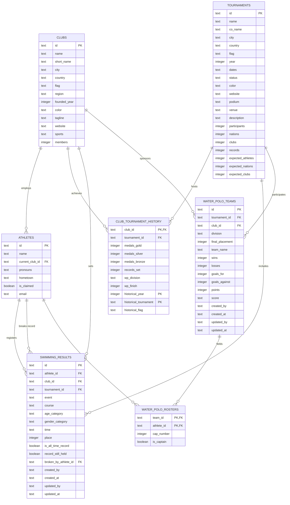

# IGLA+ Records — System Architecture

This document describes the overall purpose, technical architecture, database schema, design system, and ingestion pipeline for the IGLA+ Records application. It serves as the developer reference for future feature expansion, schema migrations, and style updates.

---

## 1. Overview & Purpose

IGLA+ Records is a unified web application for the **International Group of LGBTQIA+ Aquatics (IGLA+)**. It replaces legacy spreadsheets with a browsable archive of championship results, member clubs, all-time records, and athlete profiles.

### Core Goals
- **Data Integrity:** Keep a unified, relational representation of athletes, clubs, tournaments, and performance statistics.
- **Performant Queries:** Deliver near-instant filtering across all-time records and tournament result feeds.
- **Neobrutalist User Interface:** Maintain the chunky, high-contrast, high-fidelity visual identity of the "G3 Splash & Depth" design system.
- **Robust Ingestion:** Enable administrators to upload raw championship CSV files and resolve naming conflicts using fuzzy matching.

---

## 2. Technical Stack

The application is built with the following technologies:
- **Framework:** Next.js 16 (App Router)
- **Runtime/Language:** React 19, TypeScript
- **Database:** SQLite (embedded local file `igla.db`) via the `better-sqlite3` library
- **Styling:** CSS variables for system tokens + Tailwind CSS v4
- **Icons:** `lucide-react`
- **CSV Ingestion:** `papaparse`
- **Authentication:** Custom cookie-based session handler utilizing AES-256-GCM encryption

---

## 3. Database Architecture

The relational schema is configured in [schema.sql](file:///Users/mwillmott/Antigravity/igla-records/src/db/schema.sql) and is loaded into `igla.db` during seeding.

### Entity-Relationship Diagram



### Table Definitions & Roles

1. **`clubs`**
   - Stores master profiles for all IGLA+ member clubs.
   - Includes visual brand identity (e.g., `color` stored as OKLCH or hex) and region classifications.

2. **`tournaments`**
   - Represents past, live, and upcoming IGLA+ Championships.
   - Tracks stats (participant counts, total records set) and expected estimates for upcoming tournaments.

3. **`club_tournament_history`**
   - Connects clubs to specific tournaments.
   - Stores medals won, records set, and water polo division outcomes.
   - Features nullable foreign keys and historical text columns (`historical_tournament`) to capture historical data for legacy tournaments that lack detailed pages.

4. **`athletes`**
   - The registry of all swimmers and polo players.
   - Profiles can be "claimed" once verified by the user.

5. **`swimming_results`**
   - Individual swim times and rankings.
   - Handles record status flags (`is_all_time_record`, `record_still_held`) and self-references the athlete who subsequently broke the record.
   - Stores tracking metadata (`created_by`, `created_at`, `updated_by`, `updated_at`) for audit logging.

6. **`water_polo_teams`**
   - Placements and records for water polo teams inside tournaments.
   - Tracks division details and results.
   - Houses administrative tracking columns.

7. **`water_polo_rosters`**
   - Resolves the many-to-many relationship between `water_polo_teams` and `athletes`.
   - Tracks individual cap numbers and team captains.

---

## 4. Championship Ingestion Pipeline

The ingestion dashboard (/admin) lets administrators upload raw result CSV files, matching incoming names with the relational database of athletes.

### Ingestion Steps

```
[ Upload CSV File ]
        │
        ▼
[ Run Ingestion Parser (/api/admin/upload) ]
        │
        ├─► Exact Case-Insensitive Name Match? ─────► [ Stage: Exact Match (Auto) ]
        │
        ├─► Levenshtein Similarity Match >= 70%? ───► [ Stage: Naming Conflict (Admin Resolver) ]
        │
        └─► No similarity matches? ────────────────► [ Stage: New Profile Creation (Auto) ]
        │
        ▼
[ Admin Resolves Conflicts ] ──► (Merge to database athlete OR create a new profile)
        │
        ▼
[ Run DB Ingestion Transaction (/api/admin/resolve) ]
        │
        ├─► Insert new athletes
        ├─► Insert swimming results
        ├─► Increment club medals and records set
        └─► Update tournament record totals
```

### Technical details

1. **Fuzzy Naming Recognition:**
   - Evaluates incoming athlete names against database profiles using a Levenshtein Distance algorithm.
   - Calculation:
     $$Similarity = 1.0 - \frac{EditDistance}{MaxLength}$$
   - Any result score $\ge 70\%$ is flagged as a conflict. The top 3 matching database candidates are presented to the administrator.

2. **Database Commit Transaction:**
   - Located in `/api/admin/resolve/route.ts`.
   - All insertion statements execute within a single atomic SQLite transaction:
     ```ts
     const transaction = db.transaction(() => {
       // 1. Commit exact matches
       // 2. Insert new athletes and record their times
       // 3. Process conflict decisions (merges vs new profiles)
       // 4. Update Club Tournament History tables
       // 5. Update overall Tournament record counters
     });
     ```
   - Ensuring atomic transactional commits guards against corrupted data sets and preserves database integrity.

---

## 5. Visual Theme & CSS Tokens (G3 Splash & Depth)

The visual design system is defined as custom properties in [globals.css](file:///Users/mwillmott/Antigravity/igla-records/src/app/globals.css).

### Color Palette

| CSS Variable | Hex Code | Semantic Purpose |
|---|---|---|
| `--bg` | `#eaf4f7` | Pale aqua page wash |
| `--bg-2` | `#d8eaf0` | Secondary surface background |
| `--paper` | `#ffffff` | Primary sheet card background |
| `--ink` | `#0d3a52` | Deep teal primary text and borders |
| `--ink-2` | `#3a4a55` | Secondary text |
| `--ink-3` | `#6e7a85` | Caption and disabled text |
| `--aqua` | `#37a3c4` | Accent highlight color |
| `--coral` | `#ff6f50` | Records and live indicators |

### Neobrutalist Properties

- **Solid Borders:** Heavy structures with `2px solid var(--ink)` on tiles and elements.
- **Hard Offsets:** Shadows lack Gaussian blur, utilizing hard directional offsets instead:
  ```css
  --tile-shadow: 5px 6px 0 var(--ink);
  --tile-shadow-md: 3px 4px 0 var(--ink);
  --tile-shadow-sm: 2px 3px 0 var(--ink);
  ```
- **Depth Texture:** Large hero cards utilize a custom layered overlay gradient that creates subtle horizontal depth bands:
  ```css
  --depth-overlay: linear-gradient(180deg, rgba(255,255,255,0)...);
  ```

### Typography

- **Display Fonts:** `"Instrument Serif"`, Georgia, serif. Internal emphasis wrapped in `<em>` displays italic highlights.
- **UI Text:** `"Geist"`, sans-serif.
- **Monospace Fields:** `"Geist Mono"`, monospace (for times, years, and statistics).

---

## 6. Security, Authentication & Audit Trails

### User Session Logic
- Configured in [auth.ts](file:///Users/mwillmott/Antigravity/igla-records/src/lib/auth.ts).
- User sessions are stored in an encrypted cookie named `igla_session`.
- Decryption and encryption utilize an AES-256-GCM cipher with a `SESSION_SECRET` key to safeguard authentication signatures.

### Authorization Gates (RBAC)
- Admin privileges are verified by reviewing email addresses. User accounts ending with `@igla.org` are granted the `admin` role.
- Server-side gates restrict access to `/admin` and POST request endpoints (such as updating records or resolving conflicts).

### Relational Audit Logging
- Modification endpoints write the acting administrator's email to `updated_by` and save a timestamp to `updated_at`.
- The frontend reads these indicators and presents an audit trail detailing who updated a result and when.

---

## 7. Directory Structures

```
├── design-handoff/           # Legacy prototypes and static datasets
├── scripts/
│   ├── seed.js               # SQL seeding script parsing handoff arrays into sqlite
│   └── find-empty-pills.js   # Utility validation check script
├── src/
│   ├── db/
│   │   ├── index.ts          # Database instance initialization (better-sqlite3)
│   │   └── schema.sql        # Database schema DDL
│   ├── lib/
│   │   └── auth.ts           # AES-256-GCM cookie session encryption handlers
│   └── app/
│       ├── layout.tsx        # Next.js global layout
│       ├── globals.css       # Full G3 CSS design system
│       ├── admin/            # Ingestion dashboard and components
│       ├── api/              # backend API handlers (records, uploads, resolutions)
│       ├── athletes/         # Athlete profile detail routes
│       ├── clubs/            # Club listing and detail routes
│       ├── results/          # Records dashboard routes
│       └── tournaments/      # Tournament listing and detail routes
└── igla.db                   # SQLite database
```
