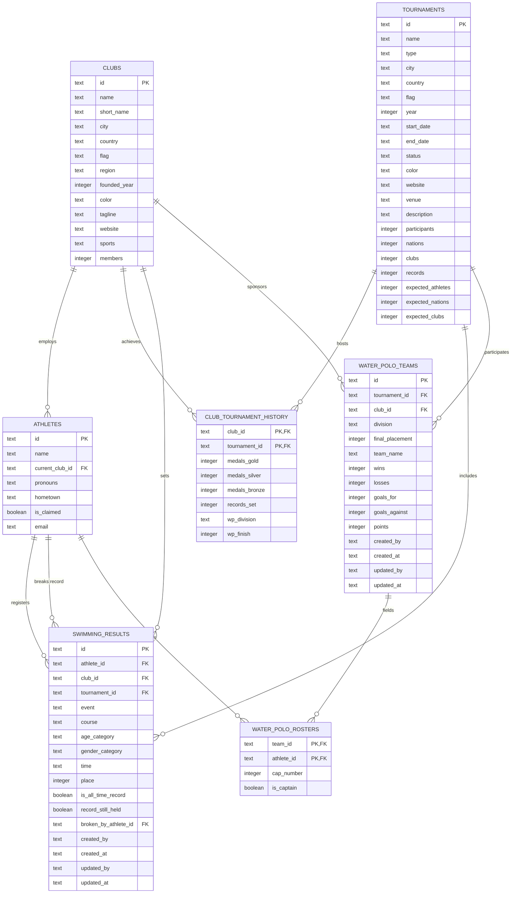

# IGLA+ Records — System Architecture

This document describes the overall purpose, technical architecture, database schema, design system, and ingestion pipeline for the IGLA+ Records application. It serves as the developer reference for future feature expansion, schema migrations, and style updates.

---

## 1. Overview & Purpose

IGLA+ Records is a unified web application for the **International Group of LGBTQIA+ Aquatics (IGLA+)**. It replaces legacy spreadsheets with a browsable archive of championship results, member clubs, all-time records, and athlete profiles.

### Core Goals
- **Data Integrity:** Keep a unified, relational representation of athletes, clubs, tournaments, and performance statistics.
- **Performant Queries:** Deliver near-instant filtering across all-time records and tournament result feeds.
- **Neobrutalist User Interface:** Maintain the chunky, high-contrast, high-fidelity visual identity of the "G3 Splash & Depth" design system.
- **Robust Ingestion:** Enable administrators to upload raw championship CSV files and resolve naming conflicts using fuzzy matching.

---

## 2. Technical Stack

The application is built with the following technologies:
- **Framework:** Next.js 16 (App Router)
- **Runtime/Language:** React 19, TypeScript
- **Database:** SQLite (embedded local file `igla.db`) via the `better-sqlite3` library
- **Styling:** CSS variables for system tokens + Tailwind CSS v4
- **Icons:** `lucide-react`
- **CSV Ingestion:** `papaparse`
- **Authentication:** Custom cookie-based session handler utilizing AES-256-GCM encryption

---

## 3. Database Architecture

The relational schema is configured in [schema.sql](file:///Users/mwillmott/Antigravity/igla-records/src/db/schema.sql) and is loaded into `igla.db` during seeding.

### Entity-Relationship Diagram



### Table Definitions & Roles

1. **`clubs`**
   - Stores master profiles for all IGLA+ member clubs.
   - Includes visual brand identity (e.g., `color` stored as OKLCH or hex) and region classifications.

2. **`tournaments`**
   - Represents past, live, and upcoming IGLA+ Championships.
   - Tracks stats (participant counts, total records set) and expected estimates for upcoming tournaments.

3. **`club_tournament_history`**
   - Connects clubs to specific tournaments.
   - Stores medals won, records set, and water polo division outcomes.
   - Serves as a summary override table for legacy tournaments (like Paris 2018 or New York 2019) where individual results are not available in the database. For detailed tournaments with raw results, these tallies are resolved dynamically.

4. **`athletes`**
   - The registry of all swimmers and polo players.
   - Profiles can be "claimed" once verified by the user.

5. **`swimming_results`**
   - Individual swim times and rankings.
   - Handles record status flags (`is_all_time_record`, `record_still_held`) and self-references the athlete who subsequently broke the record.
   - Stores tracking metadata (`created_by`, `created_at`, `updated_by`, `updated_at`) for audit logging.

6. **`water_polo_teams`**
   - Placements and records for water polo teams inside tournaments.
   - Tracks division details and results.
   - Houses administrative tracking columns.

7. **`water_polo_rosters`**
   - Resolves the many-to-many relationship between `water_polo_teams` and `athletes`.
   - Tracks individual cap numbers and team captains.

---

## 4. Championship Ingestion Pipeline

The ingestion dashboard (/admin) lets administrators upload raw result CSV files, matching incoming names with the relational database of athletes.

### Ingestion Steps

```
[ Upload CSV File ]
        │
        ▼
[ Run Ingestion Parser (/api/admin/upload) ]
        │
        ├─► Exact Case-Insensitive Name Match? ─────► [ Stage: Exact Match (Auto) ]
        │
        ├─► Levenshtein Similarity Match >= 70%? ───► [ Stage: Naming Conflict (Admin Resolver) ]
        │
        └─► No similarity matches? ────────────────► [ Stage: New Profile Creation (Auto) ]
        │
        ▼
[ Admin Resolves Conflicts ] ──► (Merge to database athlete OR create a new profile)
        │
        ▼
[ Run DB Ingestion Transaction (/api/admin/resolve) ]
        │
        ├─► Insert new athletes
        ├─► Insert swimming results
        └─► Update tournament record totals (medals are dynamically resolved)
```

### Technical details

1. **Fuzzy Naming Recognition:**
   - Evaluates incoming athlete names against database profiles using a Levenshtein Distance algorithm.
   - Calculation:
     $$Similarity = 1.0 - \frac{EditDistance}{MaxLength}$$
   - Any result score $\ge 70\%$ is flagged as a conflict. The top 3 matching database candidates are presented to the administrator.

2. **Database Commit Transaction:**
   - Located in `/api/admin/resolve/route.ts`.
   - All insertion statements execute within a single atomic SQLite transaction:
     ```ts
     const transaction = db.transaction(() => {
       // 1. Commit exact matches
       // 2. Insert new athletes and record their times
       // 3. Process conflict decisions (merges vs new profiles)
       // 4. Update overall Tournament record counters (medals are dynamically resolved)
     });
     ```
   - Ensuring atomic transactional commits guards against corrupted data sets and preserves database integrity.

---

## 5. Visual Theme & CSS Tokens (G3 Splash & Depth)

The visual design system is defined as custom properties in [globals.css](file:///Users/mwillmott/Antigravity/igla-records/src/app/globals.css).

### Color Palette

| CSS Variable | Hex Code | Semantic Purpose |
|---|---|---|
| `--bg` | `#eaf4f7` | Pale aqua page wash |
| `--bg-2` | `#d8eaf0` | Secondary surface background |
| `--paper` | `#ffffff` | Primary sheet card background |
| `--ink` | `#0d3a52` | Deep teal primary text and borders |
| `--ink-2` | `#3a4a55` | Secondary text |
| `--ink-3` | `#6e7a85` | Caption and disabled text |
| `--aqua` | `#37a3c4` | Accent highlight color |
| `--coral` | `#ff6f50` | Records and live indicators |

### Neobrutalist Properties

- **Solid Borders:** Heavy structures with `2px solid var(--ink)` on tiles and elements.
- **Hard Offsets:** Shadows lack Gaussian blur, utilizing hard directional offsets instead:
  ```css
  --tile-shadow: 5px 6px 0 var(--ink);
  --tile-shadow-md: 3px 4px 0 var(--ink);
  --tile-shadow-sm: 2px 3px 0 var(--ink);
  ```
- **Depth Texture:** Large hero cards utilize a custom layered overlay gradient that creates subtle horizontal depth bands:
  ```css
  --depth-overlay: linear-gradient(180deg, rgba(255,255,255,0)...);
  ```

### Typography

- **Display Fonts:** `"Instrument Serif"`, Georgia, serif. Internal emphasis wrapped in `<em>` displays italic highlights.
- **UI Text:** `"Geist"`, sans-serif.
- **Monospace Fields:** `"Geist Mono"`, monospace (for times, years, and statistics).

---

## 6. Security, Authentication & Audit Trails

### User Session Logic
- Configured in [auth.ts](file:///Users/mwillmott/Antigravity/igla-records/src/lib/auth.ts).
- User sessions are stored in an `httpOnly`, `sameSite=lax` encrypted cookie named `igla_session` with a 7-day `maxAge`.
- Decryption and encryption utilize an AES-256-GCM cipher. The key is derived via `scrypt` from a `SESSION_SECRET` environment variable.
  - ⚠️ **Security note:** `auth.ts` falls back to a hardcoded default secret when `SESSION_SECRET` is unset. A real secret **must** be provided in any non-local environment, or session tokens are trivially forgeable.

### Login Flow & Auth Endpoints
Authentication is handled by a small set of route handlers under `/api/auth`:
- **`/api/auth/login`** — initiates the sign-in flow.
- **`/api/auth/callback`** — the core handler. It supports two paths:
  1. **Google OAuth** — exchanges the `?code` authorization code for tokens at `oauth2.googleapis.com`, fetches the user profile from the Google userinfo endpoint, derives the role, and sets the session cookie. Requires `GOOGLE_CLIENT_ID`, `GOOGLE_CLIENT_SECRET`, and optionally `GOOGLE_REDIRECT_URI`.
  2. **Developer mock login** — `?mock=admin` or `?mock=user` short-circuits OAuth and issues a fully-formed session **with no credentials**.
     - ⚠️ **Security note:** the mock path is an unauthenticated admin backdoor and must be disabled/guarded before any production deployment.
- **`/api/auth/session`** — returns the current decoded session for the client UI.
- **`/api/auth/logout`** — clears the `igla_session` cookie.

After a successful login, admins are redirected to `/admin` and regular users to `/results`.

### Authorization Gates (RBAC)
- Admin privileges are verified by reviewing email addresses. User accounts ending with `@igla.org` are granted the `admin` role (derived in the callback handler); everyone else is a `user`.
- Server-side gates (`getSession()` / `session.role !== 'admin'`) restrict access to every `/admin` page and every `/api/admin/*` POST endpoint (uploads, conflict resolution, record/team edits, roster edits, and clubs/tournaments CRUD).

### Relational Audit Logging
- Modification endpoints write the acting administrator's email to `updated_by` and save a timestamp to `updated_at`.
- The frontend reads these indicators and presents an audit trail detailing who updated a result and when.

---

## 7. Clubs Management Console

The Clubs Management Console (`/admin/clubs`) provides a full-featured administrative interface for managing member organizations.

### Key Operations & Features
1. **Dynamic List View**: Displays all member clubs with client-side sorting (by Name, Members, Founded, and Medals), pagination, real-time query searching (across Name, City, Country, and Tagline), and centralized filter selectors (by Region and Sport).
2. **Add & Edit Drawer**: A side-drawer interface for club profile creation and modification:
   - **Auto-slug ID**: Creates a slug-formatted unique ID from the club name automatically for new clubs, but permits manual adjustment. Once saved, the ID slug is locked to protect foreign-key database constraints.
   - **Interactive Live Preview**: Renders a mockup of the public club card in real-time as the admin types.
   - **Centralized Configurations**: Uses single-source-of-truth lists for regions and aquatic disciplines from [config.ts](file:///Users/mwillmott/Antigravity/igla-records/src/lib/config.ts).
3. **Cascade-Aware Safety Deletion**: Deleting a club triggers a verification modal:
   - Calls the impact counting API to calculate affected records.
   - Summarizes the cascading delete impact (swimming results, water polo teams, and history entries) and athlete affiliations that will be reset.
   - Requires the administrator to type the club's short name exactly to confirm.

### Backend CRUD APIs
- **GET `/api/admin/clubs/impact`**: Queries the database using `better-sqlite3` to count referencing records across `swimming_results`, `water_polo_teams`, `club_tournament_history`, and `athletes` for a specified `id`.
- **POST `/api/admin/clubs/save`**: Handles atomic inserts and updates. Restructures snake_case payload variables to align with required database columns and runs transaction validation checks.
- **POST `/api/admin/clubs/delete`**: Executes the database deletion. SQLite foreign key constraints (`ON DELETE CASCADE` / `ON DELETE SET NULL`) automatically handle cleaning up related tables.

---

## 8. Tournaments Management Console

The Tournaments Management Console (`/admin/tournaments`) provides a full-featured administrative interface for managing past, live, and upcoming IGLA+ championships.

### Key Operations & Features
1. **Dynamic List View**: Displays all tournaments with client-side sorting (by Year, Name, Participants, and Records), pagination, real-time query searching (across Name, City, Type, Country, and Venue), and status filtering. The stats column is simplified to display unified athletes and clubs counts.
2. **Add & Edit Drawer**: A side-drawer interface for tournament profile creation and modification:
   - **Auto-slug ID**: Creates a slug-formatted unique ID from the name automatically for new tournaments, but permits manual adjustment. Once saved, the ID slug is locked to protect foreign-key database constraints.
   - **Centralized Dropdowns**: Uses centralized single-source-of-truth type selection dropdowns (`type`, renamed from `co_name`) defined in [config.ts](file:///Users/mwillmott/Antigravity/igla-records/src/lib/config.ts).
   - **Date Range Input**: Collects distinct `start_date` and `end_date` coordinates via date pickers.
   - **Interactive Live Preview**: Renders a mockup of the public tournament card in real-time as the admin types.
   - **Conditional Stat Inputs**: Displays actual attendance stats inputs (Participants, Nations, Clubs, Records) for past and live tournaments; upcoming tournaments have no stats input fields.
3. **Cascade-Aware Safety Deletion**: Deleting a tournament triggers a verification modal:
   - Calls the impact counting API to calculate affected records.
   - Summarizes the cascading delete impact (swimming results and water polo standings) and history entries that will be reset to null.
   - Requires the administrator to type the tournament's name exactly to confirm.

### Backend CRUD APIs
- **GET `/api/admin/tournaments/impact`**: Queries the database using `better-sqlite3` to count referencing records across `swimming_results`, `water_polo_teams`, and `club_tournament_history` for a specified `id`.
- **POST `/api/admin/tournaments/save`**: Handles atomic inserts and updates. Validates required fields, validates that the tournament type is matching config list options, checks for duplicate IDs, and updates the SQLite database.
- **POST `/api/admin/tournaments/delete`**: Executes the database deletion. SQLite foreign key constraints (`ON DELETE CASCADE` / `ON DELETE SET NULL`) automatically handle cleaning up related tables.

---

## 9. Results & Roster Management Console

The Results Management Console (`/admin/results`) lets administrators correct and curate individual performance data after ingestion, for both swimming and water polo.

### Key Operations & Features
1. **Dynamic Server-Side Querying & Pagination**:
   * To support large datasets (e.g. 3,000+ swimming results), filtering, sorting, and pagination (`LIMIT`/`OFFSET` queries) are handled entirely on the server.
   * Client interactions synchronize state with the URL using Next.js routing parameters.
   * A 250ms debouncer prevents excessive server requests while typing in the search bar.
   * React 19 `useTransition` manages search state updates, displaying a neobrutalist glassmorphic loading spinner overlaying the results table during data fetches.
2. **Multi-Championship Querying**:
   * Supports a championship selector value of `'All'`, which bypasses specific tournament filters and allows administrators to query, search, and sort across all championships globally.
3. **Restructured Two-Row Filter Toolbar**:
   * **Top Row**: Contains the `Championship Event` dropdown (with a Trophy icon box prefix next to it) on the left, and the `Search Results` input on the right. Both inputs are nested under top-level baseline-aligned labels.
   * **Bottom Row**: Groups secondary filters (`Course`, `Age Group`, `Gender Category`, `Record Status`, or `Division` depending on sport mode). It includes a dynamic "Clear Filters" button on the far right that appears when filters are active.
   * Height constraints (`h-10` / `40px` heights) are locked on selectors and buttons, and the search container uses inline `style={{ flex: 'none' }}` to prevent height collapses.
4. **Water Polo Standings & Roster Counts**:
   * Displays water polo standings showing placement, record, club represented, and division.
   * Replaces static subtext placeholders with a dynamic roster player count (e.g., `7 players registered`) computed efficiently using a subselect on the `water_polo_rosters` table.
5. **Edit Result Modal**: The shared [EditResultModal](file:///Users/mwillmott/Antigravity/igla-records/src/app/components/EditResultModal.tsx) component edits a single record in place:
   - **Swimming results** — event, course, age/gender category, time, place, record flags (`is_all_time_record`, `record_still_held`), athlete linkage, and the "broken by" athlete reference.
   - **Water polo teams** — team name, club, division, final placement, and the win/loss/goals/points statistics.
6. **Water Polo Roster Editing**: Rosters for a water polo team can be edited inline. Adding a player supports either selecting an existing athlete or **creating a brand-new athlete profile on the fly** (auto-generating a slug ID, defaulting pronouns/hometown), all within a single atomic transaction. Duplicate-roster and missing-team conditions are rejected with descriptive errors.
7. **Audit Trail**: Every edit stamps `updated_by` (the acting admin's email) and `updated_at`, which surface in the UI as a "who/when" indicator (see §6).

### Backend & Page Routes
- **Page `/admin/results/swimming`**: Renders swimming results list using dynamic server query bindings.
- **Page `/admin/results/waterpolo`**: Renders water polo standings list and selects roster size via a subquery.
- **POST `/api/admin/records/update`**: Updates a single `swimming` or `wp` record by `id`, writing audit columns. Returns 404 if the target row does not exist.
- **POST `/api/admin/records/delete`**: Deletes a single swimming result or water polo team.
- **POST `/api/admin/roster/add`**: Adds an athlete (existing or newly created) to a water polo roster with cap number and captain flag, inside a transaction.
- **POST `/api/admin/roster/delete`**: Removes an athlete from a roster.

### Placeholder Admin Panels
One further panel exists in the navigation but is an intentional stub marked *"scheduled for development in Phase 4"*:
- **`/admin/settings`** — planned admin-account management and global configuration (e.g. age-category rules).

---

## 10. Athletes Management Console

The Athletes Management Console (`/admin/athletes`) provides a full-featured administrative interface for managing registered athlete profiles.

### Key Operations & Features
1. **Dynamic List View**: Displays all athletes with client-side sorting (by Name, Club, Claim Status, and Results), pagination, real-time query searching (across Name, ID, Hometown, Email, and Club Name), and status filtering (by Club, Claim Status, and Sport Discipline).
2. **Dedicated Email & Status Columns**: Displays the athlete's email (if provided) in a dedicated column with `mailto:` links, alongside a colored badge indicating claim status.
3. **Add & Edit Drawer**: A side-drawer interface for athlete profile creation and modification:
   - **Auto-slug ID**: Creates a slug-formatted unique ID from the athlete name automatically on creation, but permits manual adjustment. Once saved, the ID slug is locked to protect foreign-key database constraints.
   - **Pronouns Dropdown**: Uses centralized pronoun presets defined in [config.ts](file:///Users/mwillmott/Antigravity/igla-records/src/lib/config.ts), with a toggle for custom pronoun write-ins.
   - **Optional Email Field**: Allows optional association of an email address to the profile, which enforces strict uniqueness checking.
   - **Interactive Live Preview**: Renders a mockup of the public athlete card profile in real-time as the admin types.
4. **Cascade-Aware Safety Deletion**: Deleting an athlete triggers a verification modal:
   - Calls the impact counting API to calculate affected records.
   - Summarizes the cascading delete/nulling impact (swim results unlinked, records broken by unlinked, and water polo roster spots deleted).
   - Requires the administrator to type the athlete's name exactly to confirm.

### Backend CRUD APIs
- **GET `/api/admin/athletes/impact`**: Queries the database using `better-sqlite3` to count referencing records across `swimming_results` and `water_polo_rosters` for a specified `id`.
- **POST `/api/admin/athletes/save`**: Handles atomic inserts and updates. Restructures snake_case payload variables to align with required database columns, checks for duplicate IDs, validates email formatting, and enforces email uniqueness checks.
- **POST `/api/admin/athletes/delete`**: Executes the database deletion. SQLite foreign key constraints handle cleanups or nulling related records.

---

## 11. Club Summaries Management Console

The Club Summaries Management Console (`/admin/results/history`) provides an administrative CRUD interface for managing legacy, aggregate club history records (`club_tournament_history`).

### Key Operations & Features
1. **Dynamic List View**: Displays all historical summaries with page routing state sync, searching, sorting, and pagination.
2. **Medal Badges Unification**: Displays club medal counts (Gold, Silver, Bronze) utilizing the standard neobrutalist badge components referencing the `--gold`, `--silver`, and `--bronze` CSS variables, maintaining visual continuity with public profile directories.
3. **Operational Guidance & Narrow Subhead**: Features a detailed operational notice that clarifies how stubs behave (legacy stubs override dynamically calculated stats on public pages, and individual result logs should be preferred). The description text uses a `maxWidth: '750px'` layout constraint to avoid wrapping the actions buttons row.
4. **Interactive Creation Modal**:
   - **Searchable Dropdowns**: Integrates a reusable [SearchableSelect](file:///Users/mwillmott/Antigravity/igla-records/src/app/components/SearchableSelect.tsx) dropdown selector for selecting clubs and tournaments.
   - **Duplicate Record Validation**: Integrates background verify API checks on create mode. Selecting a club-tournament combination that already exists dynamically disables the submit button and renders a red `Duplicate Record Blocked` notice.
   - **Locked Fields on Edit**: Disables selector inputs when editing a record, locking the primary keys (`club_id`, `tournament_id`) to protect database schema constraints.
   - **Silent Background Verification**: DB records verification runs silently in the background, showing warnings directly on resolve rather than flashing distracting loaders.
   - **Clean States**: Resets local modal input states completely on close to prevent ghost warning indicators and race conditions when transitioning from edit mode to create mode.

### Backend CRUD APIs
- **GET `/api/admin/clubs/check-results`**: Inspects the database for existing swimming/water polo records or existing summary rows for a specified `clubId` and `tournamentId` combination.
- **POST `/api/admin/clubs/history/save`**: Saves/upserts (`ON CONFLICT(club_id, tournament_id) DO UPDATE`) aggregate stats into `club_tournament_history`.
- **POST `/api/admin/clubs/history/delete`**: Deletes a legacy club summary override by its compound key.

---

## 12. Directory Structures

```
├── design-handoff/           # Legacy prototypes and static datasets
├── scripts/
│   ├── seed.js               # SQL seeding script parsing handoff arrays into sqlite
│   ├── find-empty-pills.js   # Utility validation check script
│   └── test-endpoints.js     # API endpoint smoke-test script
├── src/
│   ├── db/
│   │   ├── index.ts          # Database instance initialization (better-sqlite3)
│   │   └── schema.sql        # Database schema DDL
│   ├── lib/
│   │   ├── auth.ts           # AES-256-GCM cookie session + Google OAuth helpers
│   │   └── config.ts         # Centralized lists (sports, regions, age categories,
│   │                         #   water polo divisions, tournament types, pronouns)
│   └── app/
│       ├── layout.tsx        # Next.js global layout
│       ├── globals.css       # Full G3 CSS design system
│       ├── components/       # Shared UI (Header.tsx, EditResultModal.tsx, EditClubHistoryModal.tsx, SearchableSelect.tsx)
│       ├── (public)/         # Public route group (shared public layout)
│       │   ├── athletes/     # Athlete profile detail routes
│       │   ├── clubs/        # Club listing and detail routes
│       │   ├── results/      # Records dashboard routes
│       │   └── tournaments/  # Tournament listing and detail routes
│       ├── admin/            # Admin panels: ingestion (page.tsx), clubs, tournaments,
│       │                     #   results (with history/), athletes, settings (stub)
│       └── api/
│           ├── auth/         # login, callback (OAuth + mock), session, logout
│           └── admin/        # upload, resolve, records, roster, clubs (with check-results/ and history/), tournaments, athletes
└── igla.db                   # SQLite database
```
